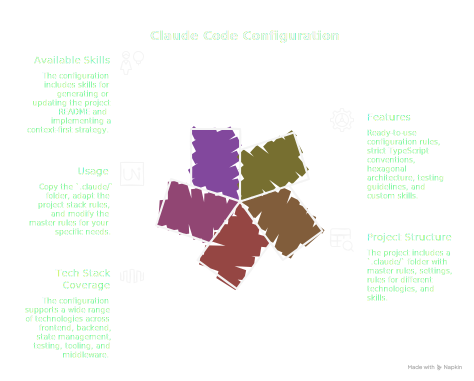

<div align="center">
  
</div>

- [Claude Code Workflow](#claude-code-workflow)
  - [Features](#features)
  - [Project Structure](#project-structure)
  - [Tech Stack Coverage](#tech-stack-coverage)
  - [Usage](#usage)
  - [Available Skills](#available-skills)
  - [Enabled Plugins](#enabled-plugins)

# Claude Code Workflow

Configuration and conventions to optimize Claude Code usage on TypeScript/React projects.

## Features

- Ready-to-use Claude Code configuration rules
- Strict TypeScript conventions with recommended patterns
- Hexagonal architecture for React applications
- Testing guidelines with Testing Library
- Custom skills (readme, context-first)

## Project Structure

```
.claude/
├── CLAUDE.md              # Master rules
├── settings.json          # Claude Code configuration
├── rules/
│   ├── project-stack.md   # Supported tech stack
│   ├── react/
│   │   ├── component-patterns.md
│   │   └── hexagonal-architecture.md
│   └── typescript/
│       ├── testing-guidelines.md
│       └── typescript-conventions.md
└── skills/
    ├── readme/            # README generation
    └── context-first/     # Context-first implementation strategy
```

## Tech Stack Coverage

| Category   | Technologies                                              |
| ---------- | --------------------------------------------------------- |
| Frontend   | React, Next.js, Vite, TypeScript, Tailwind CSS, ShadCN UI |
| Backend    | Node.js, Fastify, Express, NestJS, Supabase               |
| State      | Zustand, TanStack Query, React Context                    |
| Testing    | Vitest, Jest, React Testing Library                       |
| Tooling    | ESLint, Prettier, pnpm, Docker                            |
| Middleware | Auth0, Stripe                                             |

## Usage

1. Copy the `.claude/` folder to the root of your project
2. Adapt `rules/project-stack.md` according to your stack
3. Modify `CLAUDE.md` for your specific rules

## Available Skills

| Skill            | Description                                          |
| ---------------- | ---------------------------------------------------- |
| `/readme`        | Generates or updates the project README.md           |
| `/context-first` | Context-first implementation based on provided files |

## Enabled Plugins

- `frontend-design` - Production-grade frontend interfaces
- `feature-dev` - Guided feature development
- `code-simplifier` - Simplification and refactoring
- `typescript-lsp` - TypeScript LSP support
- `pyright-lsp` - Python LSP support
